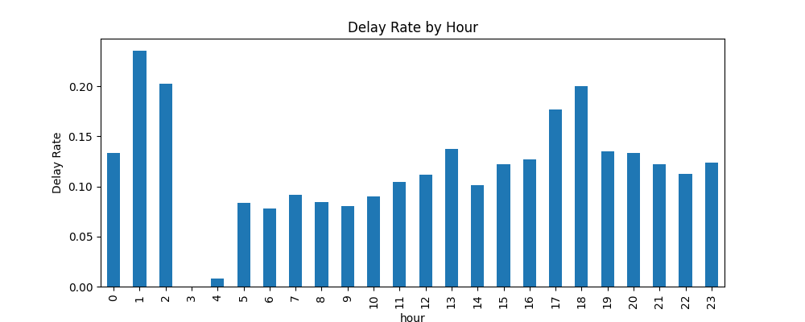

# NJ Transit Delay Prediction

Predicting whether an NJ Transit train will be delayed (>5 minutes) using time and route data.

> **Note:** This dataset covers May 2020, during COVID-19 lockdowns. Ridership and scheduling were unusual during this period, so results may not fully generalize to normal conditions.

## Problem

Commuters want to know one simple thing: *will my train be late?* This project builds a binary classifier that predicts whether a scheduled NJ Transit train will be delayed by more than 5 minutes, using only information available ahead of time - hour, day of week, line, and train type.

## Data

- Source: [NJ Transit + Amtrak (NEC) Rail Performance](https://www.kaggle.com/datasets/pranavbadami/nj-transit-amtrak-nec-performance) dataset (Kaggle)
- 98,698 raw records for May 2020; 87,172 after cleaning
- Target: `is_delayed` (1 if `delay_minutes` > 5, else 0)
- Class balance: ~88% on-time, ~12% delayed

## Approach

1. **Cleaning** — Investigated ~11.5K rows missing `delay_minutes`. Initially suspected cancellations, but checking directly showed the vast majority were trains that departed with no delay recorded — a data collection gap, not a cancellation pattern. These rows were dropped since there's nothing to train on without a target value.
2. **Feature engineering** — Extracted `hour` and `day_of_week` from timestamps; one-hot encoded `line` and `type`.
3. **Handling class imbalance** — Used a stratified train/test split (80/20) to preserve the true 88/12 ratio in both sets, and `class_weight='balanced'` during training to prevent models from just defaulting to "always predict on-time."
4. **Modeling** — Compared three models to see how each handled the imbalance differently (see results below).

## Results

| Model | Recall (delayed) | Precision (delayed) | F1-score |
|---|---|---|---|
| Logistic Regression (plain) | 11% | 70% | 0.19 |
| Logistic Regression (balanced) | 55% | 22% | 0.31 |
| **Random Forest (balanced)** | **72%** | 27% | **0.39** |

The plain model had high accuracy (88.5%) but was nearly useless in practice — it caught only 11% of real delays by defaulting to "on-time" for most predictions, since that's the safe statistical bet given the class imbalance. Balancing the classes and switching to Random Forest raised recall to 72%, catching far more real delays, with Random Forest outperforming on both recall and F1-score rather than just trading one metric for another.

## Key Finding

Feature importance from the Random Forest shows **time matters far more than route**: `hour` (47%) and `day_of_week` (17%) together account for 64% of the model's decisions — more than all 12 individual lines combined. Delay rates climb during evening rush hour (5–6pm) and are consistently lower on weekends, matching the pattern shown above.

## Limitations & Next Steps

- Recall still tops out at 72% — about 1 in 4 real delays are still missed
- Precision remains low (27%) — most "delayed" predictions are false alarms
- Only one (pandemic-era) month of data was used; more months could reveal seasonal patterns and improve generalization
- Next: add station-level features, tune Random Forest hyperparameters, and experiment with custom probability thresholds to better balance precision and recall

## Tech Stack

Python · pandas · scikit-learn · matplotlib · Google Colab

## Files

- `NJTransit_Delay_Prediction.ipynb` — full notebook (data cleaning → EDA → modeling → evaluation)
- `delay_by_hour.png` — delay rate by hour chart
